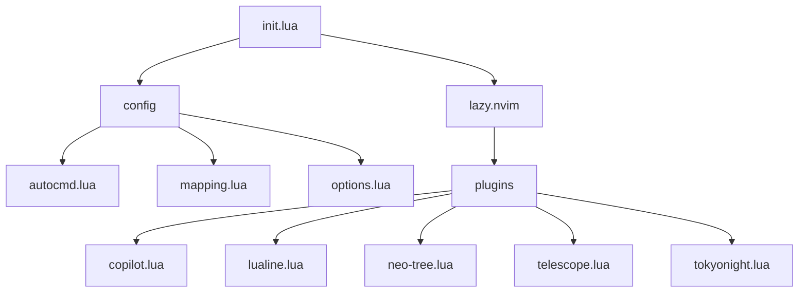

# 構成

## init.lua
エントリーファイル。
単体で動作するconfigファイルの読み込みと、プラグイン管理をするlazy.nvimの読み込みをしている。

## plugins
lazy.nvimで管理しているプラグインの設定ファイル。
プラグイン名.lua になっている。

### tokyonight
テーマプラグイン。

### lualine
ボトムバーに表示されている。

### neo-tree
サイドバーのファイルツリー。

### copilot
GitHub copilotを使う。
